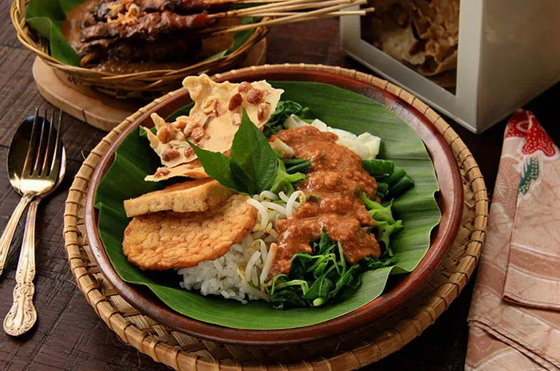
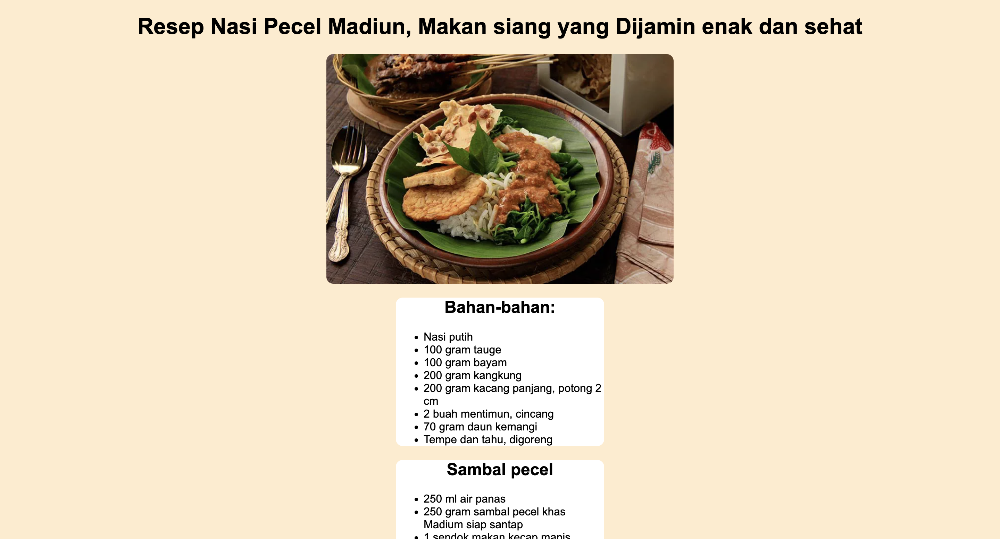

# Resep Nasi Pecel Madiun



Deskripsi singkat proyek ini adalah tampilan sederhana HTML dan CSS yang menampilkan resep Nasi Pecel Madiun.

## Tentang

Proyek ini bertujuan untuk memberikan informasi tentang resep dan cara membuat Nasi Pecel Madiun menggunakan HTML dan CSS.

## Fitur

- Tampilan resep Nasi Pecel Madiun
- Informasi bahan-bahan dan cara membuat
- Foto makanan

## Demo


## Kontribusi

Jika Anda ingin berkontribusi pada proyek ini, silakan buat `fork` dari repositori ini, buat cabang baru, lakukan perubahan Anda, dan buat `pull request`.

```bash
git fork https://github.com/username/nasi-pecel-madiun.git
git checkout -b perubahan-fitur
# Lakukan perubahan Anda
git add .
git commit -m "Menambahkan fitur baru"
git push origin perubahan-fitur
